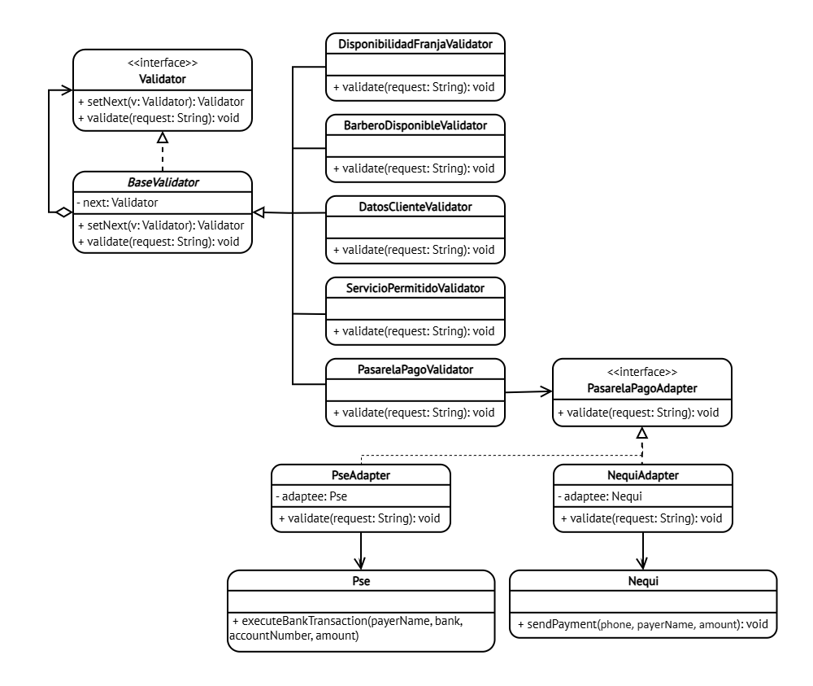

# DOSW_Parcial_T1_CristianOrtiz

#### **Nombre:** Cristian Camilo Ortiz Sanchez
**Curso:** DOSW-1

**Nombre del enunciado:** Enunciado 2

Acceso a draw.io:

Acceso a figma: 

## Parcial parte 1 (Diagrama de contexto)

---

## Parcial parte 2 (requerimientos del sistema)

### REQUERIMIENTOS FUNCIONALES

| Codigo | Descripcion |
|:---|:---|
| BB-01 | Un turno debe pasar por las siguientes validaciones (Disponibilidad de franja -> Barbero disponible -> Datos del cliente -> Servicio permitido -> Pasarela de pago) |
| BB-02 | Reservar unicamente los servicios del catalogo activo |
| BB-03 | Procesar pagos a través de diferentes plataformas |

> Nota: BB-01 utiliza Chain of Responsibility y BB-03 utiliza Adapter.

### REQUERIMIENTOS NO FUNCIONALES

| Codigo | Descripcion |
|:---|:---|
| BB-RNF-01 | La web debe tener los colores de la marca Azul (#1B2A4A) y Rojo oscuro (#7B2D2D)  |
| BB-RNF-02 | La tipografia debe ser Calibri. |

---

## Parcial parte 3 (diagramas de casos de uso)

> **Requerimientos seleccionados:** BB-01, BB-03.

---

## Parcial parte 6 (patrones)

- **a.** 1. Nombre del patron: Chain of Responsibility. Tipo: Comportamiento.
    2. Nombre del patron: Adapter. Tipo: Estructural

- **b.** En el contexto de Bob's Barber se utiliza en la parte donde se hacen las validaciones de los turnos. Estas validaciones se hacen de manera independiente y cuando una acaba pasa a la siguiente validacion (cadena de validaciones). Chain of Responsibility nos permite eso, tener multiples handler que nos permitan hacer dichas validaciones, delegando al siguiente de la cadena. Por otro lado, el patron Adapter se utiliza en las pasarelas de pago, como cada una tiene interfaces incompatibles, lo ideal seria tener un adaptador para cada una de modo que nuestro sistema pueda realizar la transaccion sin necesidad de conocer la implementacion de los proveedores.

- **c.** Diagrama de clases

