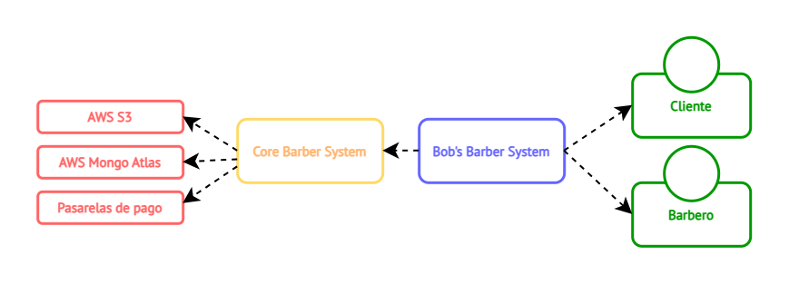
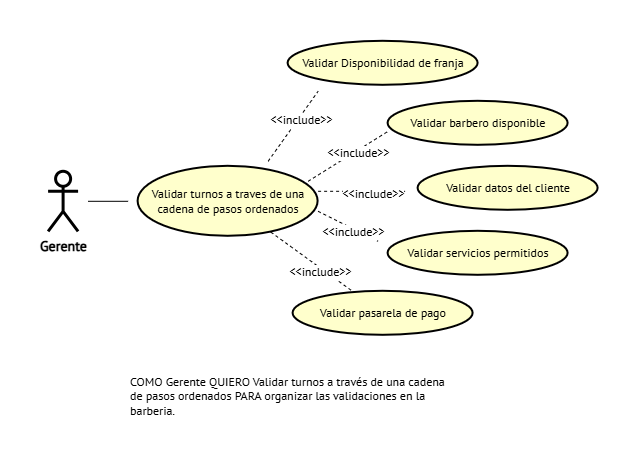

# DOSW_Parcial_T1_CristianOrtiz

#### **Nombre:** Cristian Camilo Ortiz Sanchez
**Curso:** DOSW-1

**Nombre del enunciado:** Enunciado 2

Acceso a draw.io:

Acceso a figma: 

## Parcial parte 1 (Diagrama de contexto)

---

## Parcial parte 2 (requerimientos del sistema)

### REQUERIMIENTOS FUNCIONALES

| Codigo | Descripcion |
|:---|:---|
| BB-01 | Un turno debe pasar por las siguientes validaciones (Disponibilidad de franja -> Barbero disponible -> Datos del cliente -> Servicio permitido -> Pasarela de pago) |
| BB-02 | Reservar unicamente los servicios del catalogo activo |
| BB-03 | Procesar pagos a través de diferentes plataformas |

> Nota: BB-01 utiliza Chain of Responsibility y BB-03 utiliza Adapter.

### REQUERIMIENTOS NO FUNCIONALES

| Codigo | Descripcion |
|:---|:---|
| BB-RNF-01 | La web debe tener los colores de la marca Azul (#1B2A4A) y Rojo oscuro (#7B2D2D)  |
| BB-RNF-02 | La tipografia debe ser Calibri. |

---

## Parcial parte 3 (diagramas de casos de uso)

> **Requerimientos seleccionados:** BB-01, BB-03.

